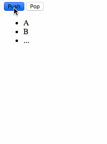

# ng-animate and angular components



`ng-animate` CSS transitions only seem to work on angular components, when the component has a `display: block` style. (tested on Chrome and Safari)

# running the example

```
$ make dev
```

which runs

```
$ open http://localhost:8000 
$ python -m SimpleHTTPServer
```

